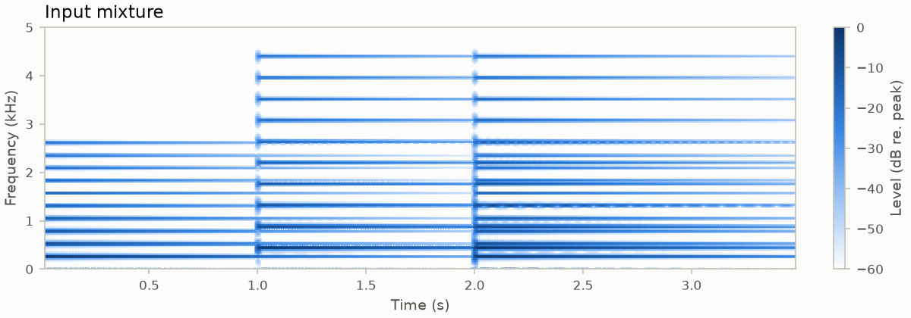
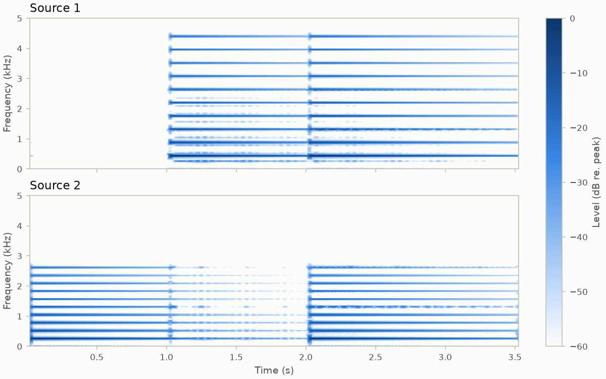
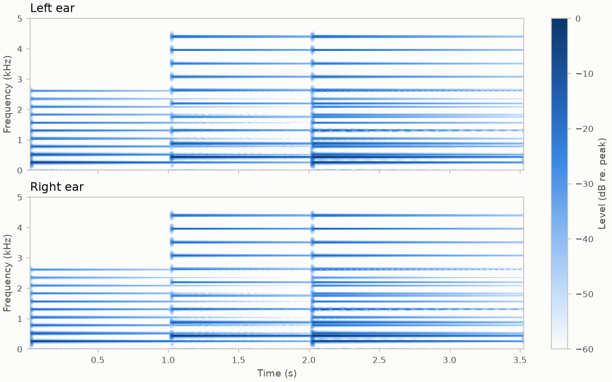

# spatial-upmixing
Mini project for a course on sound and music signal analysis.

Separates a recording into sources with NMF and renders them binaurally on four virtual loudspeakers.

## How it works

1. **STFT** – the audio file passed to `main.py` (downmixed to mono) is split into 50 ms √Hann frames with 50% overlap.
2. **NMF** – β-NMF (Itakura–Saito divergence, 2 components) factorizes the power spectrogram into spectral templates and their activations over time.
3. **Wiener filtering** – each component's share of the NMF model is used as a soft mask on the STFT; overlap-add gives one time signal per source.
4. **Binaural rendering** – the sources are convolved with HRIRs from `b_nh68.sofa` (ARI database): source 1 on the front loudspeakers (±30°), source 2 on the back ones (±120°).

The separated sources are plotted. The binaural signal is computed but not yet saved to a file.

## Example

Demo input from `generate_signal.py`: two synthetic piano notes, C4 at 0 s and A4 at 1 s, then both together at 2 s.



Separation: source 1 holds the A4 notes, source 2 the C4 notes.



Binaural output: A4 comes from the front loudspeakers, C4 from the back ones. Each pair is symmetric, so the two ears differ only slightly.



## Usage

```
conda env create -f environment.yml
conda activate spatial-upmixing
python main.py <input>
```

`<input>` is the path to the audio file to process, ideally 48 kHz to match the HRIRs. Run from the repo root, since `b_nh68.sofa` is loaded from the working directory.

Demo:

```
python generate_signal.py          # writes twoPianoTones.wav
python main.py twoPianoTones.wav
python make_figures.py             # regenerates figures/
```
